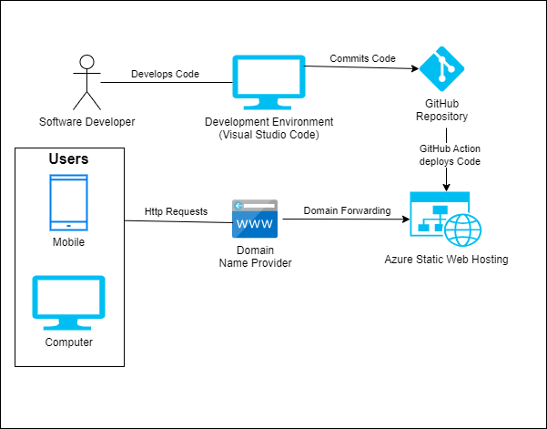
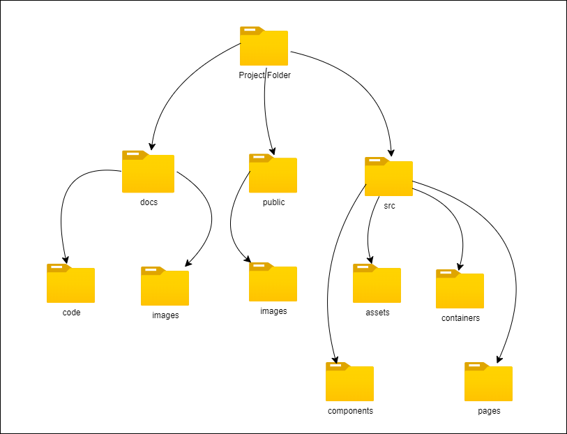

# ___Application Documentation___
This document intends to provide the reader with a greater understanding about how this application is Structured & Deployed to production.

## ___Deployment Diagram___

### ___What is a Deployment Diagram___
A deployment diagram models the physical architecture of a system. It shows the relationship between the software and hardware commponents in the system and the physical distribution of the processing.

## ___Project Folder Structure___
The image below shows the main folders within the Project.
- Within the **docs** folders, the .md files are stored. This folder has two sub-folders, **code** which contains the diagrams and **images** which contains the diagrams stored as images.
- The **public** folder contains content thats needs to be publically available. For example, images, fonts and other static files.
- The **src** folder contains the code files which are first executed by the application.
    - The **assets** subfolder, contains data such as images, textual content and scripts.
    - The **components** subfolder, contains React components which are rendered within specific pages.
    - The **containers** subfolder, contains React functions which are used to render blocks of related content. This containers may also contains React components from the **components** subfolder.
    - The **Pages** subfolder, contains the React scripts which are invoked by the "BrowserRouter" and which render the page contents.
    

