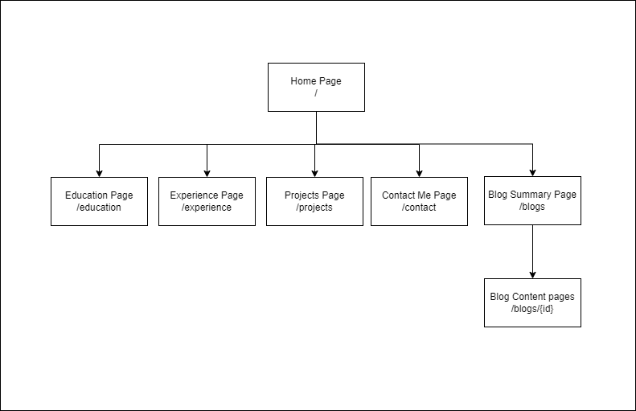

# ___Site Page Information___
This page contains information about what information and function each webpage has. Since the website is built using Javascript / React, the .js library **"react-router-dom"** is used to configuring routes with a [**BrowserRouter**](https://reactrouter.com/en/main/router-components/browser-router).

## ___Contents___
- [Sitemap](#sitemap-diagram)
- [Home](#home-page)
- [Education](#education-page)
- [Experience](#experience-page)
- [Projects](#projects-page)
- [Contact Me](#contact-me-page)
- [Blogs Summary](#blogs-summary-page)
- [Blog Contents](#blog-content-page)

## Sitemap Diagram
This sitemap is intended as a blueprint and guide for the web design and development process. It outlines the architecture and hierarchy of all the pages on the site.

## ___Home Page___
Route: **"/"**

The Home Page contains a quick introduction to myself, alongside a brief introduction into my main skill-sets.

## ___Education Page___
Route: **"/education"**

The Education page outlines my degree education, alongside a dynamically loaded list of technical certificates.

## ___Experience Page___
Route: **"/experience"**

The Experience page outlines my Job History in a Reverse Chronological order. For each job, I have highlighted my job description alongside the dates at which I was employed.

## ___Projects Page___
Route: **"/projects"**

The Projects page outlines the Projects that I have or currently am working on.

## ___Contact Me Page___
Route: **"/contact"**

The Contact Me page presents the user with a **variety of options for how they can contact me**. The most prominent example is **contacting me via email**. The page contains a form by which the user can directly contact me. 

The Page also contains a button which when clicked, **displays my CV** to the user.

## ___Blogs Summary Page___
Route: **"/blogs"**

The Blogs Summary page shows a lists of Blog summaries which when clicked will re-direct the user to the associated blogs page.

## ___Blog Content Page___
Route: **"/blogs/{id}"**

The Blog Content page renders the blog associated with the **{id}** value. Each Blog is rendered dynamically and is tagged based on the [Schema.org Article](http://schema.org/Article), so that it can be scanned quickly my search engines.

Each Blogs data is stored within the [blogs.js](..\src\assets\blogs.js) file and can be editted here by developers.

Blogs can contain Text, Ordered & Unordered Bullet points and images currently. In the future, I plan to add the functionality so that code can be rendered within the browser.